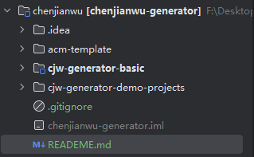
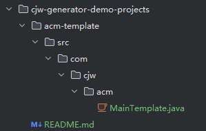
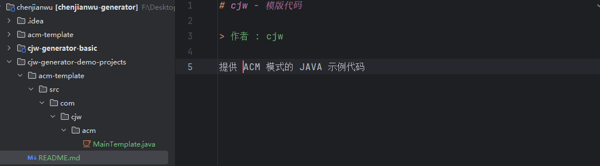
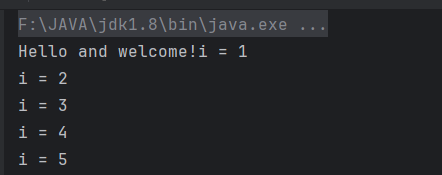
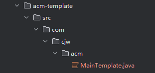
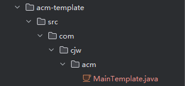

# cjw - 代码生成器共享平台

> 作者：cjw


基于 React + Spring Boot + Picocli + 对象存储的 **代码生成器共享平台** 。

开发者可以在平台上制作并发布代码生成器，用户可以搜索、下载、在线使用代码生成器，管理员可以集中管理所有用户和生成器。


## 项目简介

该项目基于命令行的本地代码生成器、代码生成器制作工具、在线代码生成器平台。


## 初始化根目录


### 准备ACM示例代码

只是一个简单的JAVA项目,没有使用Maven 和 第三方依赖
结构如下,核心组成是静态文件 README.md 和 代码文件 MainTemplate:



README.md 内容如下:



MainTemplate.java 是一段ACM示例输入代码，作用是输出多数之和。
内容如下:

```
package com.cjw.acm

import java.util.Scanner
/**
 * ACM 输入模板(多数之和)
 */

public class MainTemplate {
    public static void main(String[] args) {
        Scanner scanner = new Scanner(System.in);


        while (scanner.hasNextLine()) {
            //读取输入元素的个数
            int n = scanner.nextInt();

            //读取数组
            int[] arr = new int[n];
            for (int i = 0; i < n; i++) {
                arr[i] = scanner.nextInt();
            }

            //处理问题逻辑
            //计算数组元素之和
            int sum = 0;
            for (int num : arr) {
                sum += num;
            }
            System.out.println(sum);
        }
        scanner.close();
    }
}
```

第一阶段中,我们将改造这个方法Java代码文件，让它支持多种输入方式

### 在根目录下（chenjianwu/chenjianwu-generator） 新建cjw-generator-basic 项目

使用Maven管理项目
JDK选择1.8

在cjw-generator-basic下的Pom.xml下 添加依赖

```
<dependencies>
    <!-- https://doc.hutool.cn/ -->
    <dependency>
        <groupId>cn.hutool</groupId>
        <artifactId>hutool-all</artifactId>
        <version>5.8.16</version>
    </dependency>
    <!-- https://mvnrepository.com/artifact/org.apache.commons/commons-collections4 -->
    <dependency>
        <groupId>org.apache.commons</groupId>
        <artifactId>commons-collections4</artifactId>
        <version>4.4</version>
    </dependency>
    <!-- https://projectlombok.org/ -->
    <dependency>
        <groupId>org.projectlombok</groupId>
        <artifactId>lombok</artifactId>
        <version>1.18.30</version>
        <scope>provided</scope>
    </dependency>
    <dependency>
        <groupId>junit</groupId>
        <artifactId>junit</artifactId>
        <version>4.13.2</version>
        <scope>test</scope>
    </dependency>
</dependencies>
```

执行Main



成功输出

## 静态文件生成

我们现在已经引入了 Hutool 库的依赖

Hutool是一个功能非常齐全的工具集,报上了HTTP请求、日期时间处理、集合类处理、文件类处理、JSON处理等能够大幅度提高开发效率的工具类

Htool官方文档  https://www.hutool.cn/

在 com.cjw.generator 下新建一个StaticGenerator类

### 现成工具库复制目录

```
* 拷贝文件（Hutool 实现，会将输入目录完整拷贝到输出目录下）
* @param inputPath
* @param outputPath
  */
  public static void copyFilesByHutool(String inputPath, String outputPath) {
  FileUtil.copy(inputPath, outputPath, false);
  }
  ```

然后编写Main方法调用即可

```
public static void main(String[] args) {
//获取整个项目的根目录
String projectPath = System.getProperty("user.dir");

        File parentFile = new File(projectPath);
        //输入路径 : ACM示例代码模版目录
        String inputPath = parentFile + File.separator + "cjw-generator-demo-projects" + File.separator + "acm-template";

        //输出路径: 直接输出到项目的根目录
        String outputPath = projectPath;

        copyFilesByHutool(inputPath, outputPath);

}
```

执行后就复制了整个目录:



## 递归遍历
代码如下:
```
/**
* 递归拷贝文件（递归实现，会将输入目录完整拷贝到输出目录下）
* @param inputPath
* @param outputPath
*/
public static void copyFilesByRecursive(String inputPath, String outputPath) {
    File inputFile = new File(inputPath);
    File outputFile = new File(outputPath);
    try {
        copyFileByRecursive(inputFile, outputFile);
       } catch (Exception e) {
        System.err.println("文件复制失败");
        e.printStackTrace();
        }
}

    /**
     * 文件 A => 目录 B，则文件 A 放在目录 B 下
     * 文件 A => 文件 B，则文件 A 覆盖文件 B
     * 目录 A => 目录 B，则目录 A 放在目录 B 下
     *
     * 核心思路：先创建目录，然后遍历目录内的文件，依次复制
     * @param inputFile
     * @param outputFile
     * @throws IOException
     */
    private static void copyFileByRecursive(File inputFile, File outputFile) throws IOException {
        // 区分是文件还是目录
        if (inputFile.isDirectory()) {
            System.out.println(inputFile.getName());
            File destOutputFile = new File(outputFile, inputFile.getName());
            // 如果是目录，首先创建目标目录
            if (!destOutputFile.exists()) {
                destOutputFile.mkdirs();
            }
            // 获取目录下的所有文件和子目录
            File[] files = inputFile.listFiles();
            // 无子文件，直接结束
            if (ArrayUtil.isEmpty(files)) {
                return;
            }
            for (File file : files) {
                // 递归拷贝下一层文件
                copyFileByRecursive(file, destOutputFile);
            }
        } else {
            // 是文件，直接复制到目标目录下
            Path destPath = outputFile.toPath().resolve(inputFile.getName());
            Files.copy(inputFile.toPath(), destPath, StandardCopyOption.REPLACE_EXISTING);
        }
    }
 ```

同样执行Main方法

```
public static void main(String[] args) {
//获取整个项目的根目录
String projectPath = System.getProperty("user.dir");

        File parentFile = new File(projectPath);
        //输入路径 : ACM示例代码模版目录
        String inputPath = parentFile + File.separator + "cjw-generator-demo-projects" + File.separator + "acm-template";

        //输出路径: 直接输出到项目的根目录
        String outputPath = projectPath;

        copyFilesByRecursive(inputPath, outputPath);

}
```

复制文件目录成功




## 动态文件生成
